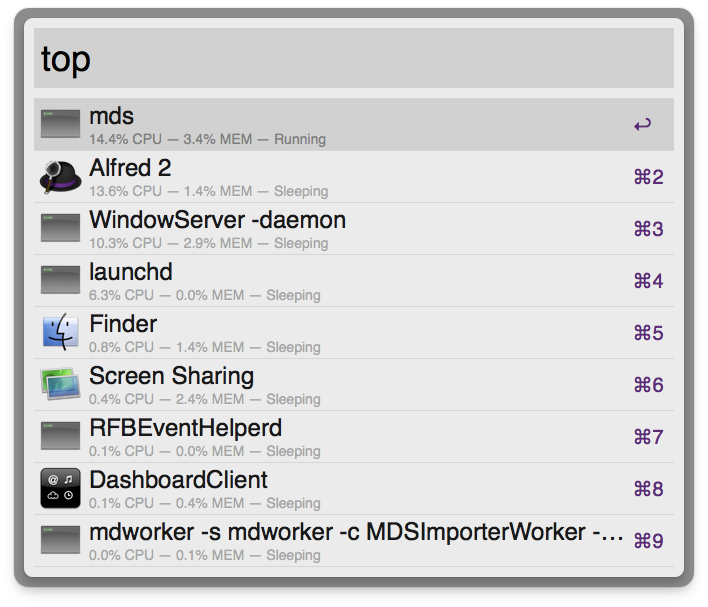
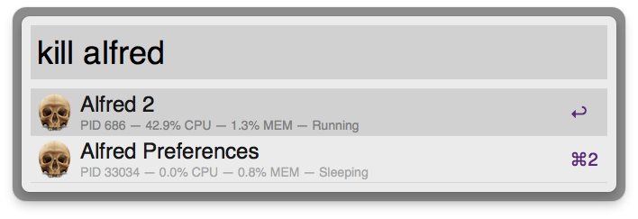

# Process Management with Alfred

> Show the most active processes. Kill any process by PID or Name.

This workflow consists of two commands, `top` and `kill`:

- use `top` to display the most active processes.
- use `kill` to find and kill any running process by its PID or Name.

[Download](Top.alfredworkflow?raw=true)
